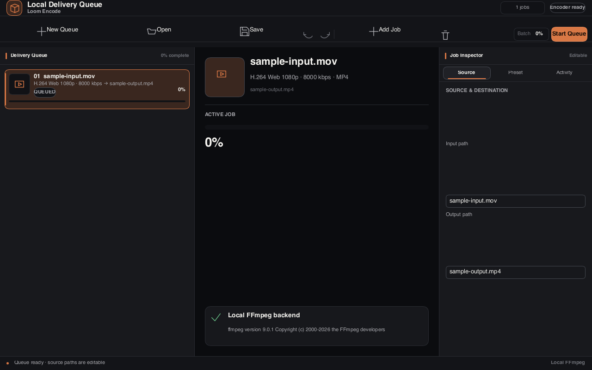

# Loom Encode

Loom Encode is a batch media transcoding and delivery powerhouse with deterministic pipeline plans, progress streaming, and watch folder automation.



## Core Capabilities

- **Batch Delivery Queue**: Reorderable job queue with real-time status indicators and progress bar tracking.
- **Format Presets**: Optimized presets for Web 1080p, 4K HDR10, Apple ProRes, Audio Master, and WebP/GIF animations.
- **Probe & Conformance**: Media stream analysis, bitrate calculation, and audio channel mapping.
- **Process Management**: Safe cooperative cancellation and job retry schedule.
- **Global Menu Bar**: Native macOS NSMenu and Linux DBusMenu global desktop menus (`Cmd/Ctrl+R` start queue, `Cmd/Ctrl+Shift+N` add job).
- **Command Palette**: `Cmd/Ctrl+K` searchable command palette.

## Visual QA Status

- **Status**: **PASS** (Toolkit & Design System Compliant).
- **Layout**: Structured delivery queue sidebar, central encoding status console, and preset inspector.
- **Chrome**: Unified `DocumentChrome`, `ToolbarGroup`, and `ToolkitStatusBar`.

## Development

```sh
cargo test --manifest-path loom-encode/Cargo.toml
cargo run --manifest-path loom-encode/Cargo.toml -p loom-encode-app
# Headless QA capture:
cargo build --manifest-path loom-encode/Cargo.toml
```
