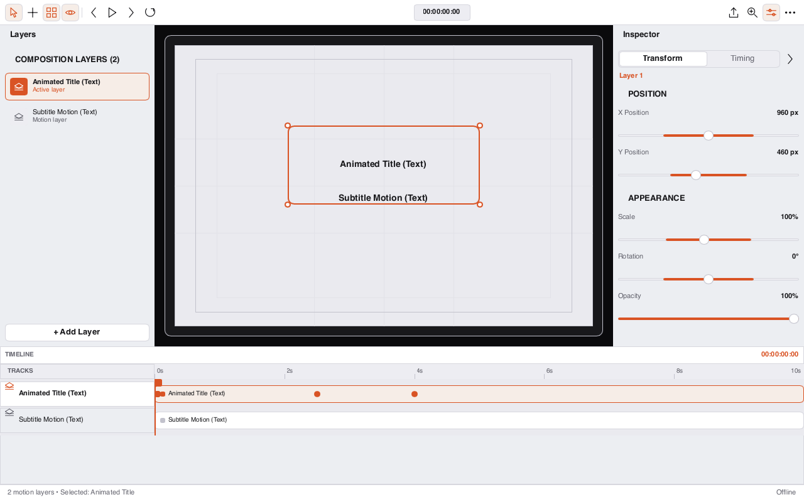

# Loom Motion

Keyframe composition editor: transform inspector, timeline, guides, SVG frame export.



## Visual QA (macOS, software renderer, 1280×800, 2026-08-25)

- - Fixed: sample title layer now holds 100% opacity from t=0 (hold to 2.5s, ease to 35% by 4s), so the canvas shows content on first launch.
- - Fixed: PAUSED/timecode transport chip moved into the toolbar transport row; canvas overlays no longer cover stage content.
- - Status bar honest: layer count, selection, Offline.

## Development

```sh
cargo test --workspace
cargo run -p loom-motion-app
# Headless QA capture (dev-only surface):
cargo build -p loom-motion-app --features visual-qa
```
