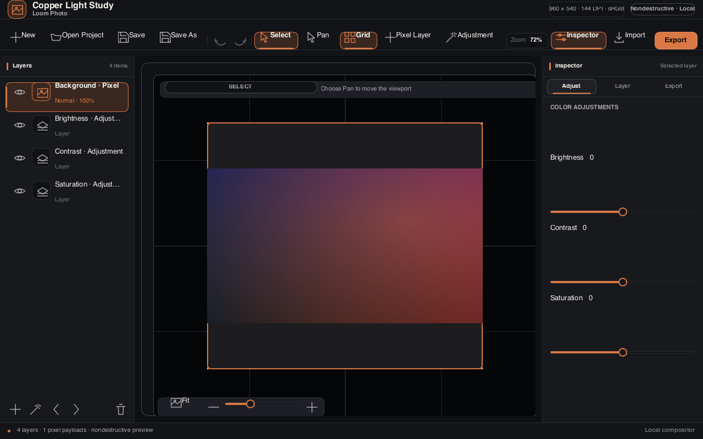

# Loom Photo

Loom Photo is a layer-based raster and image design application built with professional pixel compositing, non-destructive adjustments, and Apple Creator Studio-class desktop design.



## Core Capabilities

- **Layer-Based Compositing**: Multi-layer stack with blending modes (`Normal`, `Multiply`, `Screen`, `Overlay`), opacity control, and layer ordering.
- **Non-Destructive Adjustments**: Real-time parametric adjustments for Brightness, Contrast, Saturation, and Color Balance.
- **Canvas & Tools**: Selection, Crop, Brush, Eraser, and Transform tools with high-precision pointer tracking.
- **Format Support**: Lossless `.loomphoto` project packages with decodable PNG and JPEG exports.
- **Global Menu Bar**: Native macOS NSMenu and Linux DBusMenu global desktop menus with standard shortcuts (`Cmd/Ctrl+E` export, `Cmd/Ctrl+Shift+N` new layer).
- **Command Palette**: `Cmd/Ctrl+K` searchable fuzzy palette with instant action dispatch.

## Visual QA Status

- **Status**: **PASS** (Toolkit & Design System Compliant).
- **Layout**: Centered photo canvas surface with structured layer sidebar and adjustments inspector.
- **Chrome**: Unified `DocumentChrome`, `ToolbarGroup`, and `ToolkitStatusBar`.

## Development

```sh
cargo test --manifest-path loom-photo/Cargo.toml
cargo run --manifest-path loom-photo/Cargo.toml -p loom-photo-app
# Headless QA capture:
cargo build --manifest-path loom-photo/Cargo.toml
```
