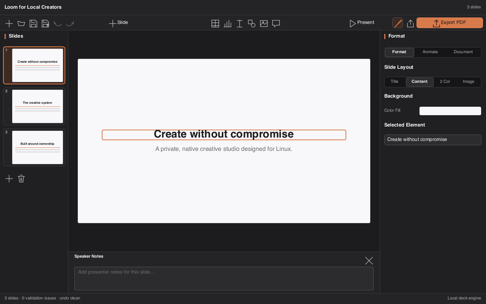

# Loom Present

Loom Present is an elegant, local-first presentation design application engineered with Apple Keynote-class aesthetic clarity and presenter tools.



## Core Capabilities

- **Keynote Theme Chooser**: Dynamic theme selection dialog with aspect ratio selector (`16:9 Widescreen` / `4:3 Standard`), categorized sidebar, and slide theme cards (`Basic White`, `Basic Black`, `Classic Editorial`, `Dynamic Accent`).
- **Slide Thumbnails Sidebar**: Miniature slide cards with slide number badges and slide layout previews.
- **Slide Canvas & Drawer**: Centered presentation surface with element bounding box and collapsible Speaker Notes drawer.
- **3-Tab Inspector**: `Format` (slide layouts, background colors, element text), `Animate` (transitions: `Dissolve`, `Push`, `Wipe`), and `Document` (aspect ratio & deck metadata).
- **Presenter Mode**: In-window presenter flow and PDF export.
- **Global Menu Bar**: Native macOS NSMenu and Linux DBusMenu global desktop menus.
- **Open Package Format**: Inspectable `.loomdeck` packages.

## Visual QA Status

- **Status**: **PASS** (Toolkit & Design System Compliant).
- **Layout**: Clean 16:9 aspect-ratio slide canvas on dark backdrop.
- **Notes Drawer**: Collapsible presenter notes panel with live binding.

## Development

```sh
cargo test --manifest-path loom-present/Cargo.toml
cargo run --manifest-path loom-present/Cargo.toml -p loom-present-app
# Headless QA capture:
cargo build --manifest-path loom-present/Cargo.toml --features visual-qa
```
