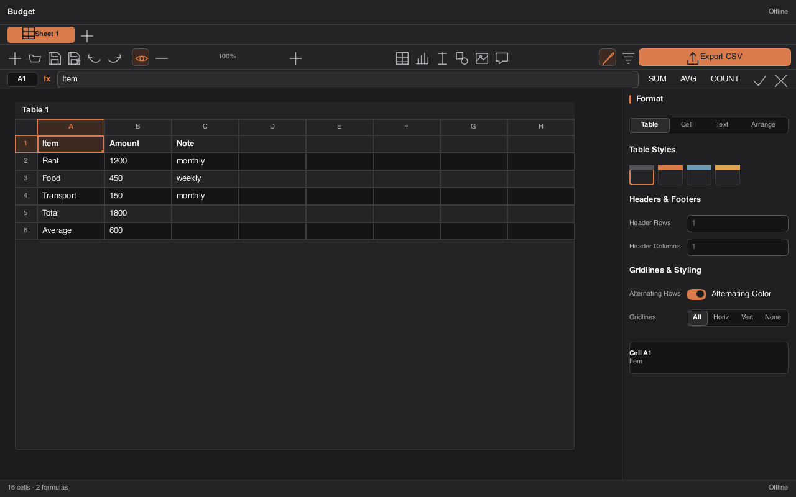

# Loom Sheets

Loom Sheets is a fast, local-first analytical spreadsheet application with Apple Numbers-class visual polish and recalculation integrity.



## Core Capabilities

- **Numbers-Style Sheet & Tab Navigation**: Multi-sheet workbook tabs (`[ ▦ Sheet 1 ] [ + ]`) and structured document chrome.
- **Action Toolbar & Formula Bar**: Primary action group, centered tool insertion, formula bar with cell coordinates badge (`[ A1 ]`), formula function chips (`SUM`, `AVG`, `COUNT`), and commit/cancel controls.
- **Spreadsheet Canvas**: Styled sheet tables with headers, column letters (A–H), row numbers, alternating row shading, and cell selection with corner circular drag handles.
- **4-Tab Inspector**: `Table` (styles, headers & footers, gridlines), `Cell` (number formatting, decimals, fills), `Text` (typography & alignments), and `Arrange` (sizing & row/column fit).
- **Template Chooser**: Categorized spreadsheet chooser modal with grid layout cards (`Blank`, `Monthly Budget`, `Invoice & Expenses`).
- **Global Menu Bar**: Native macOS NSMenu and Linux DBusMenu global desktop menus.
- **Storage & Interoperability**: Versioned `.loomtable` packages and standard CSV import/export.

## Visual QA Status

- **Status**: **PASS** (Toolkit & Design System Compliant).
- **Canvas**: Clean table viewport with responsive column expansion.
- **Formulas**: Live formula evaluation with undo/redo transaction history.

## Development

```sh
cargo test --manifest-path loom-sheets/Cargo.toml
cargo run --manifest-path loom-sheets/Cargo.toml -p loom-sheets-app
# Headless QA capture:
cargo build --manifest-path loom-sheets/Cargo.toml --features visual-qa
```
