# Loom Sheets

Loom Sheets is a local-first spreadsheet application for editing workbooks, formulas, and charts on your computer.

## Screenshots

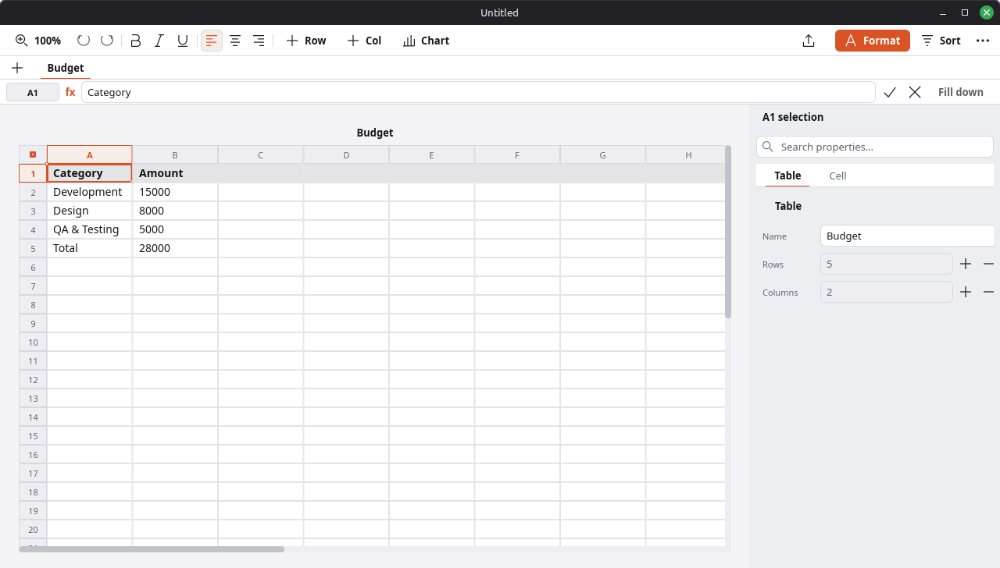
*Linux X11 native window capture from the current build, taken after focusing the Sheets window with `wmctrl` and running `/usr/bin/gnome-screenshot -w`.*

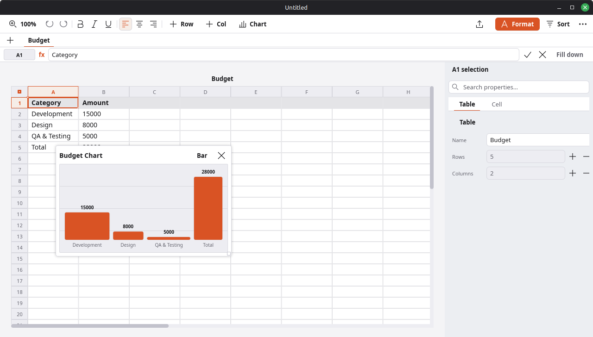
*Linux X11 native capture of the same workbook with its live formula-backed chart overlay visible.*

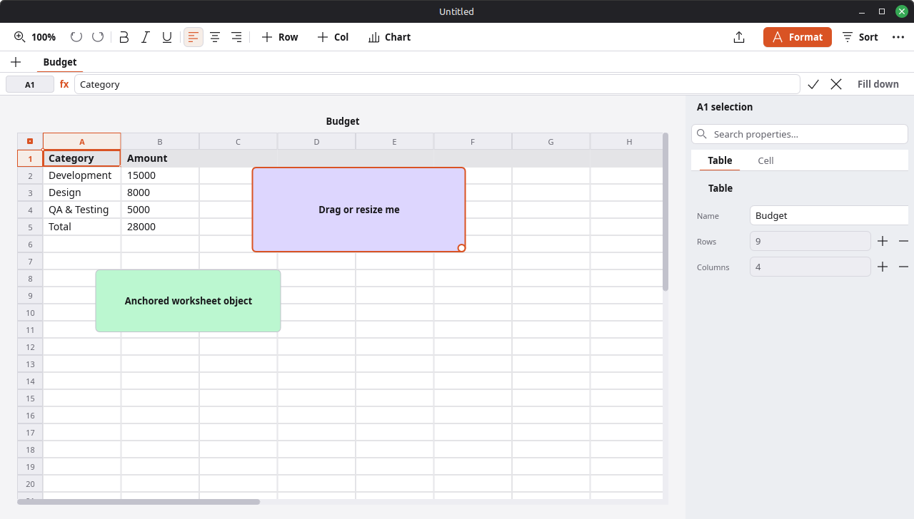
*Linux X11 native capture of the same workbook with persisted anchored worksheet objects visible in the live grid.*


*macOS native window capture (`screencapture -l`) of the current build. A pixel-reproducible renderer capture of the same state is at [docs/screenshot-deterministic.png](docs/screenshot-deterministic.png) (`cargo run -p loom-sheets-app -- --screenshot docs/screenshot-deterministic.png --size 1280x800 --theme light`).*

## Native Linux self-audit — 2026-09-23

These screenshots come from the running desktop app via `/usr/bin/gnome-screenshot -w`. Each PNG includes the native title bar and measures 1024×741 for a requested 1024×720 window.


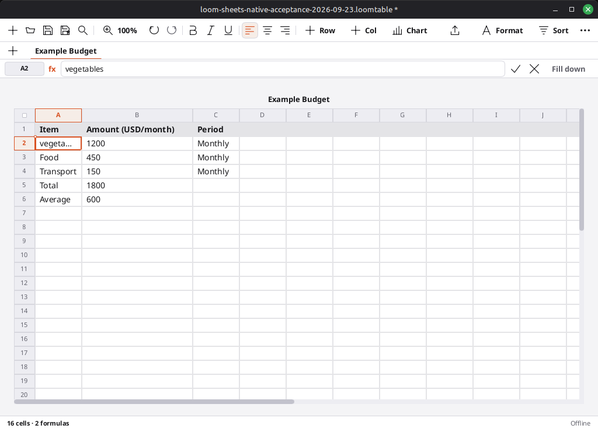

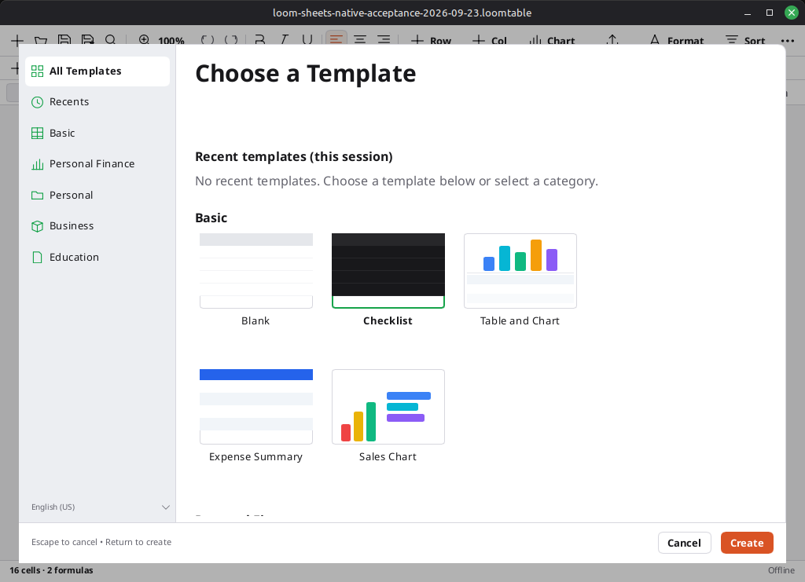

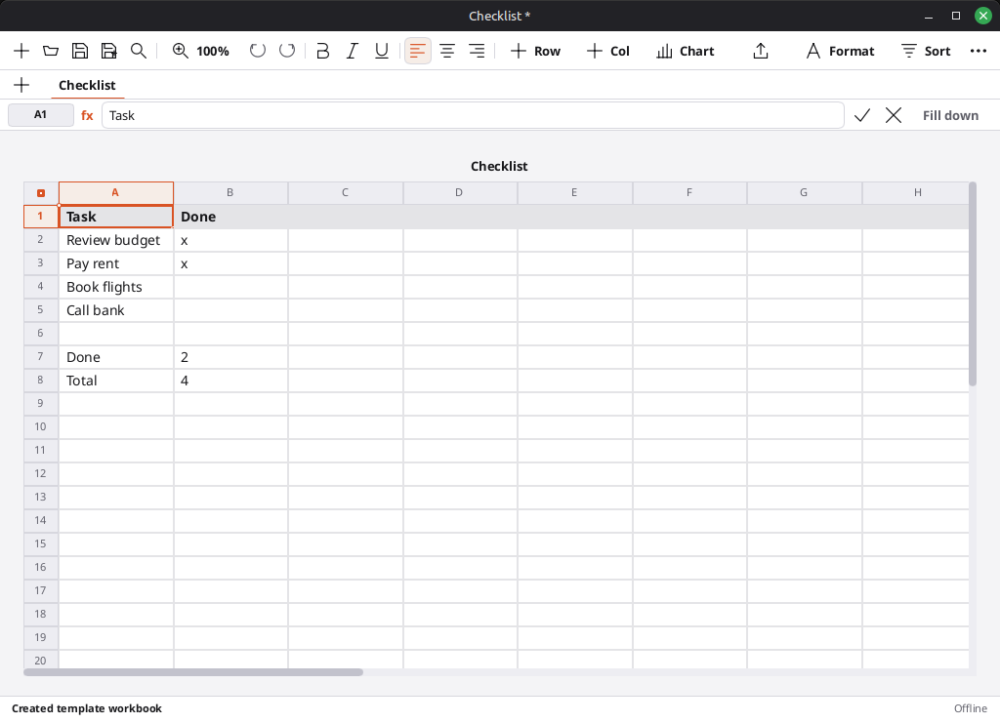

The matching keyboard, AT-SPI, Orca, and cancellation observations are in [the native self-audit report](../AGENTS.md#source-work-sheets-acceptance-2026-09-23-report-md) and the repository's portable audit evidence archive.

## Native Linux status and error feedback — 2026-09-23

These live-window captures show UI-06 feedback outside the editable grid. The two 1024×752 captures come from the final UI-06 build; the save-cancel capture shows the dirty marker and visible cancellation message.

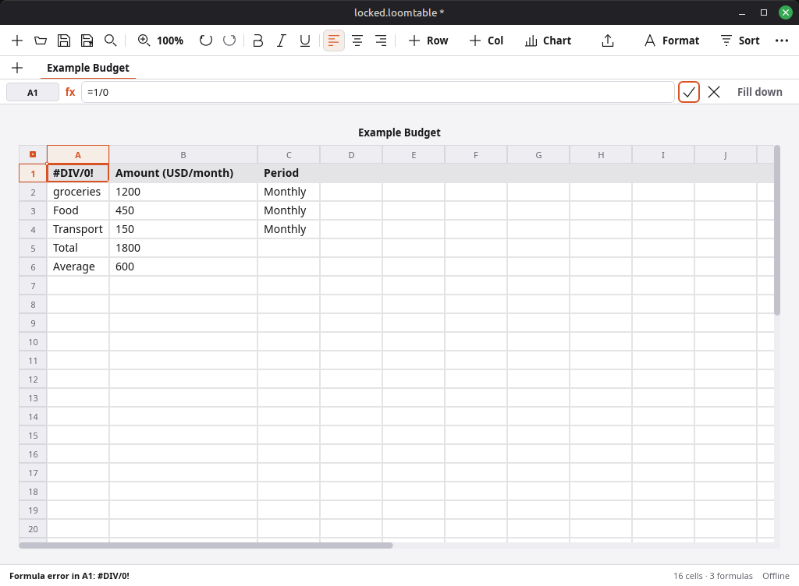

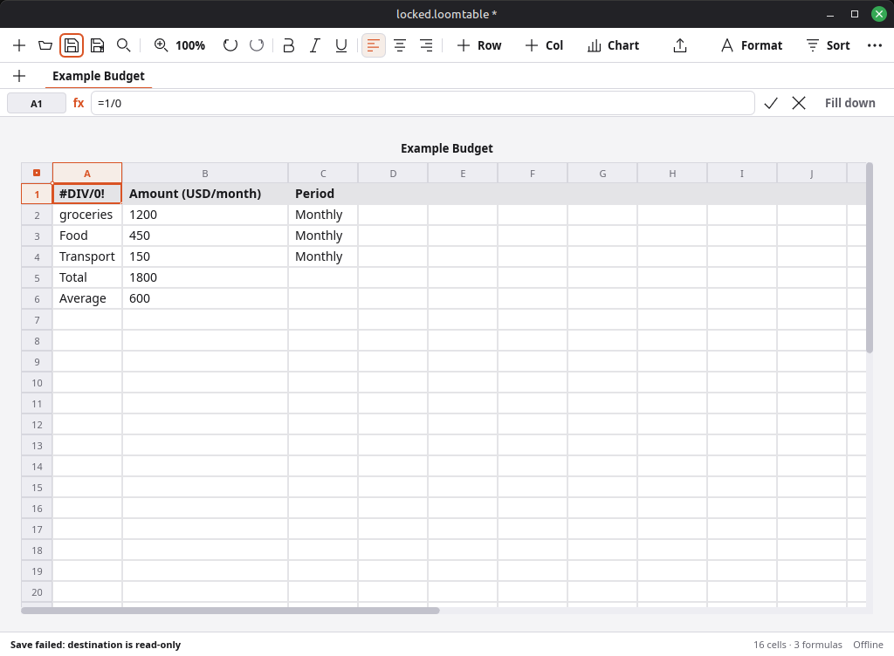

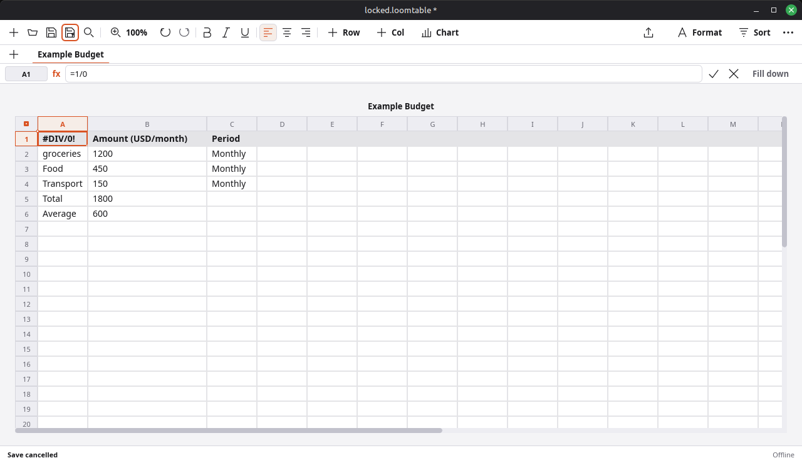

The matching test, build, and one-time Orca announcement results are recorded in [the native self-audit report](../AGENTS.md#source-work-sheets-acceptance-2026-09-23-report-md) and the portable audit evidence archive.

## Warning and menu layout repairs — 2026-09-25

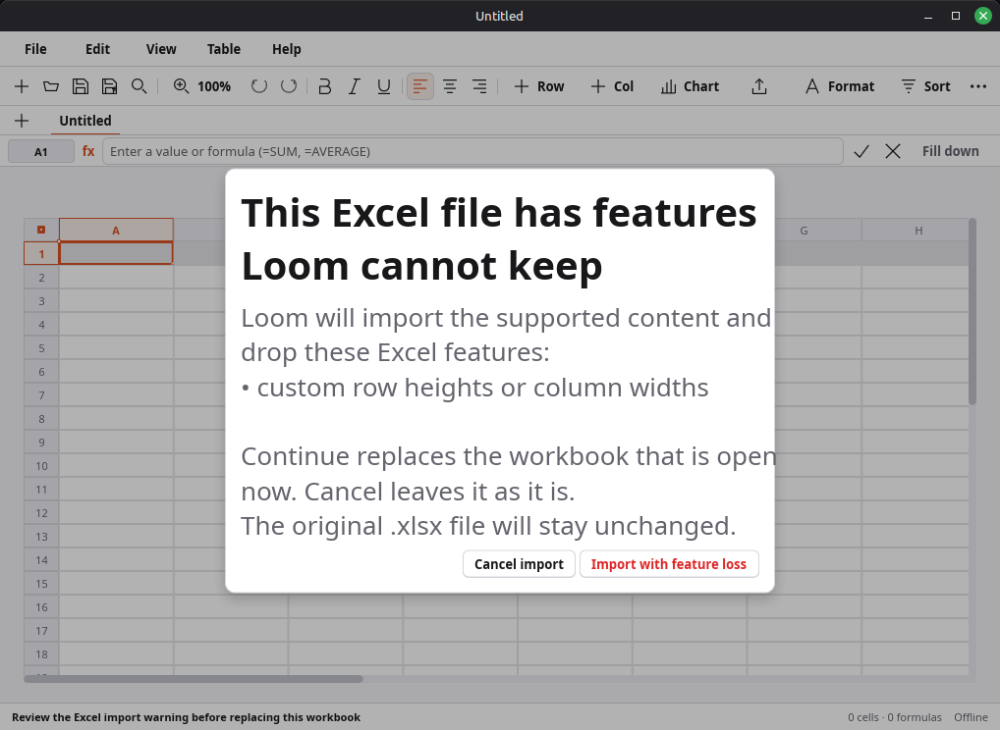

The warning dialog now grows to fit short messages, caps itself to the window, and scrolls long warning text while leaving both actions visible. Renderer checks cover a short message, 2× text, and a long message: [short](docs/qa-renderer/ui28-xlsx-warning-short-1024x720-linux.png), [short at 2×](docs/qa-renderer/ui28-xlsx-warning-short-2x-1024x720-linux.png), and [long at 2×](docs/qa-renderer/ui28-xlsx-warning-long-2x-1024x720-linux.png). The live screenshot verifies visual sizing only; dialog focus, Escape, and button effects remain under CODE-23 review.

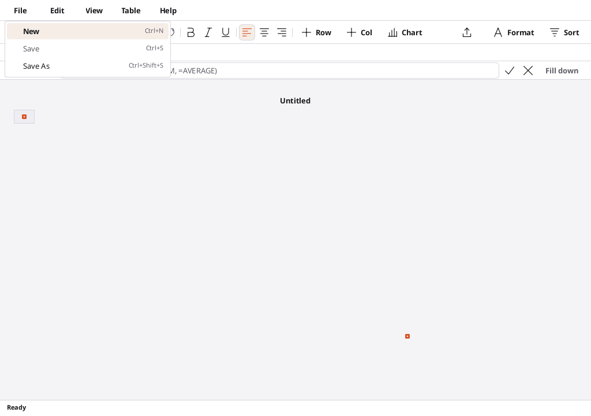

Menu rows use the shared exported `LoomMenuItem` from `loom-core/crates/loom-ui/ui/foundation.slint`. Other Loom applications should reuse it for consistent label, shortcut, check-mark, disabled, and selected layout. The popup now fits its visible rows. This menu popup image is renderer evidence; native popup interaction is still unverified under UI-01.

## Non-macOS application menu — UI-01

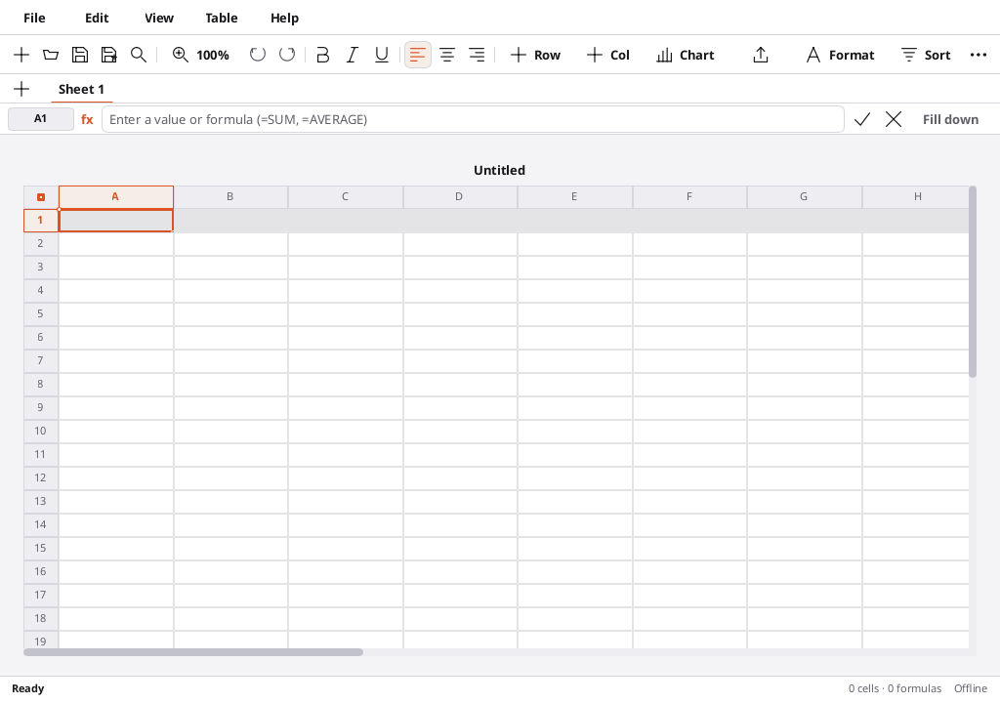

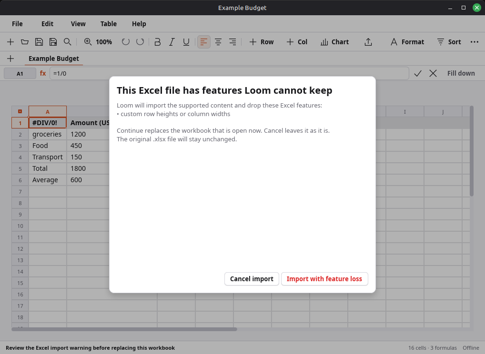

This 1024×720 image is a software-renderer capture. The native live window was captured on 2026-09-24 with the File/Edit/View/Table/Help row visible and the XLSX import-warning dialog open: [ui23-xlsx-import-warning-live-linux.png](docs/qa-native/ui23-xlsx-import-warning-live-linux.png). It confirms the row is visible and the warning copy/buttons render in the real Linux window. The popup was not opened and keyboard/focus actions were not tested because native-app controls are unavailable in this session. The old native Edit capture at [ui01-edit-menu-open-before-fix-linux.png](docs/qa-native/ui01-edit-menu-open-before-fix-linux.png) shows the bug before the fix and must not be read as current behavior. See the [2026-09-24 acceptance report](../AGENTS.md#source-loom-sheets-docs-qa-reports-2026-09-24-acceptance-follow-up-md) for exact results and remaining checks.

## Core Capabilities

- **Workbook Tabs & Navigation**: Multi-sheet workbook tabs with add/switch/rename/delete (all undoable), persisted with the active tab in versioned `.loomtable` packages.
- **Action Toolbar & Formula Bar**: Undo/redo, Bold/Italic/Underline, alignment, row/column insert, live-linked charts (Bar/Line/Pie), formula-backed pivot summaries, anchored shape/image insertion, CSV/XLSX export, zoom (75–150%), sort, overflow menu; formula bar with cell badge, SUM/AVG/COUNT quick formulas, commit/cancel, and Fill down.
- **Spreadsheet Canvas**: Viewport-filling sheet grid with headers, live selection/range marquee, keyboard navigation (arrows/Tab/Shift-extend), dynamic-array spill/error projection, anchored worksheet objects, real zoom scaling, and a floating live chart overlay.
- **Inspector**: `Table` tab (name, rows/columns add/remove) and `Cell` tab (raw formula, font style, data format incl. Number, decimals stepper, alignment, row/column sizing) — every control undoable and persisted.
- **Template Chooser**: Categorized chooser (Basic, Personal Finance, Personal, Business, Education) with eleven seeded templates, each creating its advertised sheet with live formulas.
- **Command Palette & Menus**: Ctrl+K palette covering every primary command; native macOS NSMenu plus an in-window File/Edit/View/Table/Help menu on non-macOS desktops. The local menu uses the same command IDs and live enablement as the native menu. Linux DBusMenu layout data is not connected to a desktop global-menu host, so Linux keeps the in-window menu visible.
- **Storage & Interoperability**: Versioned `.loomtable` packages (all tabs, styles, alignments, freeze panes, charts, anchored shapes/images, and package-owned embedded image assets; legacy single-sheet files still open), formula-preserving CSV import/export with dialect sniffing, and multi-sheet XLSX import/export preserving worksheet names, formulas, cached values, cell styles/alignments, one chart per sheet, shapes, and embedded images. Before replacing the current workbook, XLSX import warns about known losses in both the file picker and startup `--open` flow. The warning covers defined names, external workbook links, conditional formatting, data validation, PivotTables (cached cells only), frozen panes, custom row/column sizes, extra charts on one sheet, and missing drawing/media parts. An empty `<definedNames/>` container does not trigger a false warning. Cancel leaves the current workbook and recovery data in place; Continue imports the supported content and reports the dropped features. Native-menu and palette commands are ignored while the user decides. The warning covers known cases and does not guarantee complete Excel round-trip support. Normal Save does not overwrite the original `.xlsx`.

## Visual QA Evidence

- The existing `.work/acceptance/` set contains 18 renderer captures across four viewports and three themes, plus chooser, palette, chart, and zoom states.
- Native Linux screenshots above verify the opened workbook, dirty title, chooser selection, and template creation at 1024×720. The Escape-preserves-workbook capture is `docs/qa-native/template-cancel-preserves-workbook-linux.png`.
- The UI-06 captures verify visible formula errors, read-only save failure, and canceled Save As feedback; cancel and failure do not clear the unsaved marker.
- These captures are evidence for the named states, not a blanket acceptance claim. Remaining Sheets checks are tracked in the root [current-truth section](../AGENTS.md#current-truth).
- The XLSX loss-warning dialog passes rendered tests, including Tab navigation followed by Escape-to-Cancel. The native capture above shows the real dialog and menu row; its popup, focus, and button actions still need live interaction review.

## Performance evidence

The current 10,000-formula and million-cell measurements are recorded in [PERFORMANCE.md](../AGENTS.md#source-loom-sheets-performance-md). Formula-bar edits now submit a cell delta to a background worker; one test measured 0.086 ms for edit preparation and mailbox submission only. It did not measure the full callback or visible frame. The same one-million-cell run took 43 seconds to write recovery data. Recovery also appends full workbook packages and only compacts on explicit Save, so long unsaved sessions have no automatic storage bound. Recovery freshness, normal Save/Open, full-window scrolling, and a reviewed peak-memory limit remain open. These test timings do not prove native frame rate or complete Sheets acceptance; see the [acceptance report](../AGENTS.md#source-loom-sheets-docs-qa-reports-2026-09-24-acceptance-follow-up-md).

## Development

```sh
cargo test --manifest-path loom-sheets/Cargo.toml
cargo run --manifest-path loom-sheets/Cargo.toml -p loom-sheets-app
# Headless QA capture:
cargo build --manifest-path loom-sheets/Cargo.toml
# Native Linux X11 window capture (focus the Sheets window first):
wmctrl -l
wmctrl -i -a <sheets-window-id>
gnome-screenshot -w -f docs/screenshot-linux.png
gnome-screenshot -w -f docs/screenshot-linux-chart.png
gnome-screenshot -w -f docs/screenshot-linux-objects.png
```
