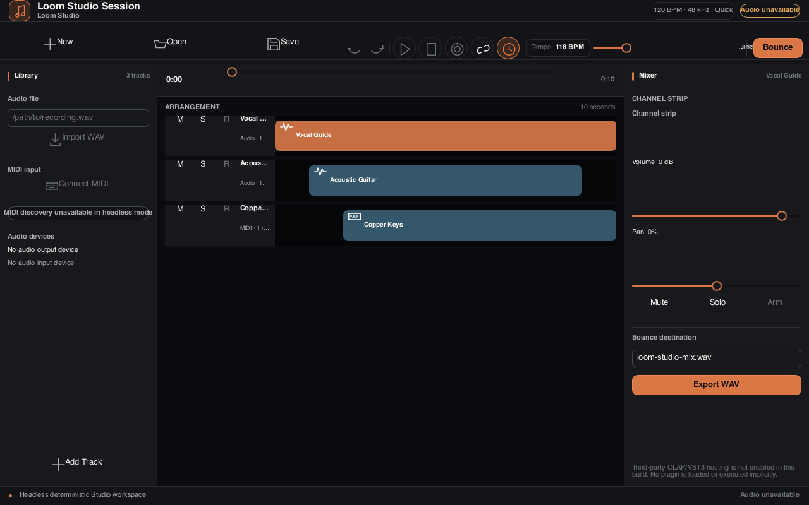

# Loom Studio

Multitrack audio session: arrangement, mixer, tempo, WAV bounce, honest device status.



## Visual QA (macOS, software renderer, 1280×800, 2026-08-25)

- - Clean capture in headless mode; audio/MIDI unavailability is stated plainly rather than faked.
- - Minor: track names truncate at panel width.

## Development

```sh
cargo test --workspace
cargo run -p loom-studio-app
# Headless QA capture (dev-only surface):
cargo build -p loom-studio-app --features visual-qa
```
