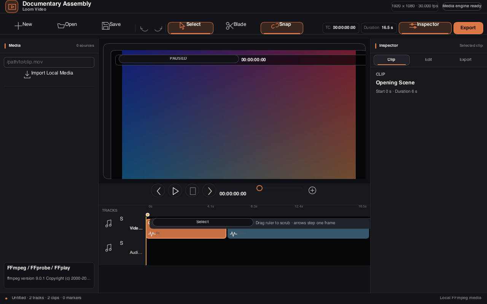

# Loom Video

NLE timeline: tracks, clips, trims, markers, local FFmpeg probing/export.



## Visual QA (macOS, software renderer, 1280×800, 2026-08-25)

- - DEFECT: track headers truncate ("Vide…", "Audi…"); Select pill overlaps the ruler row.
- - NOTE: Media panel shows "0 sources" while the timeline displays sample clips — placeholder-project state is inconsistent.
- - Honest: FFmpeg/FFprobe/FFplay version box reflects the local backend.

## Development

```sh
cargo test --workspace
cargo run -p loom-video-app
# Headless QA capture (dev-only surface):
cargo build -p loom-video-app --features visual-qa
```
