# Loom Writer

Loom Writer is a calm, professional local-first word processor engineered for private, high-clarity document composition with Apple Pages-class interface refinement.


*macOS native window capture (`screencapture -l`) of the current build. A pixel-reproducible renderer capture of the same state is at [docs/screenshot-deterministic.png](docs/screenshot-deterministic.png) (`cargo run -p loom-writer-app -- --screenshot docs/screenshot-deterministic.png --size 1280x800 --theme light`).*

## Core Capabilities

- **Rich Text Editing**: Paragraph and heading styles (`Body`, `Title`, `H1`–`H3`), font families and sizes, inline `[B][I][U][S]` controls, alignment, indent, and line spacing — every edit undoable and persisted.
- **Lists**: Bulleted and numbered lists with hanging markers in the page margin; numbering restarts after interrupts and both list kinds export to Markdown and PDF.
- **Comments**: Anchored comment threads on any text range (or the whole block from a caret), with resolve/reopen/delete, undo history, and `.loomdoc` persistence.
- **Tables**: Markdown-native table blocks inserted at the caret; the block text is the table, so cells edit as text and tables export verbatim to Markdown and PDF.
- **Page Setup**: Per-document paper size (A4 / US Letter), orientation, and margin presets — undoable, persisted, and reflected in layout, the canvas, and the exported PDF page size.
- **Document Chrome & Toolbars**: Distraction-free chrome, native global menu bar (macOS NSMenu / Linux DBusMenu), responsive action toolbar, command palette, and a scrollable Format inspector.
- **Visual Template Chooser**: Categorized template selection modal with true A4/Letter portrait previews (`Blank`, `Report`, `Letter`, `CV`).
- **Open Package Format**: Inspectable versioned `.loomdoc` storage with zero telemetry or cloud dependency.
- **Export & Recovery**: Deterministic PDF and Markdown export, DOCX interoperability, and atomic snapshot journal crash recovery.

## Visual QA Status

- **Status**: **PASS** (section 13 acceptance evidence pass, 2026-09-06).
- **Evidence**: an 18-capture viewport/theme matrix (1024×720 – 1920×1200 × light/dark/high-contrast) independently reviewed with no clipping, ellipsized labels, or contrast defects; native macOS `screencapture` QA across nine live states; an end-to-end GUI journey covering typing, formatting, lists, comments, tables, page setup, undo/redo, save/reopen, and export.
- **Remaining gate items**: explicit human visual sign-off and representative performance budgets (see the root [current-truth section](../AGENTS.md#current-truth)).

### Acceptance matrix (deterministic renderer)

| 1024×720 | 1280×800 | 1440×900 | 1920×1200 |
|---|---|---|---|
| 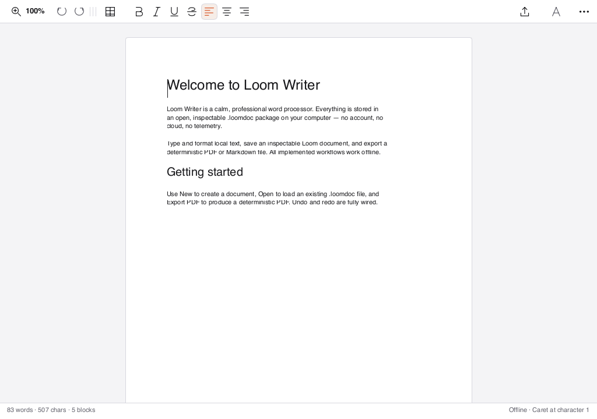 | 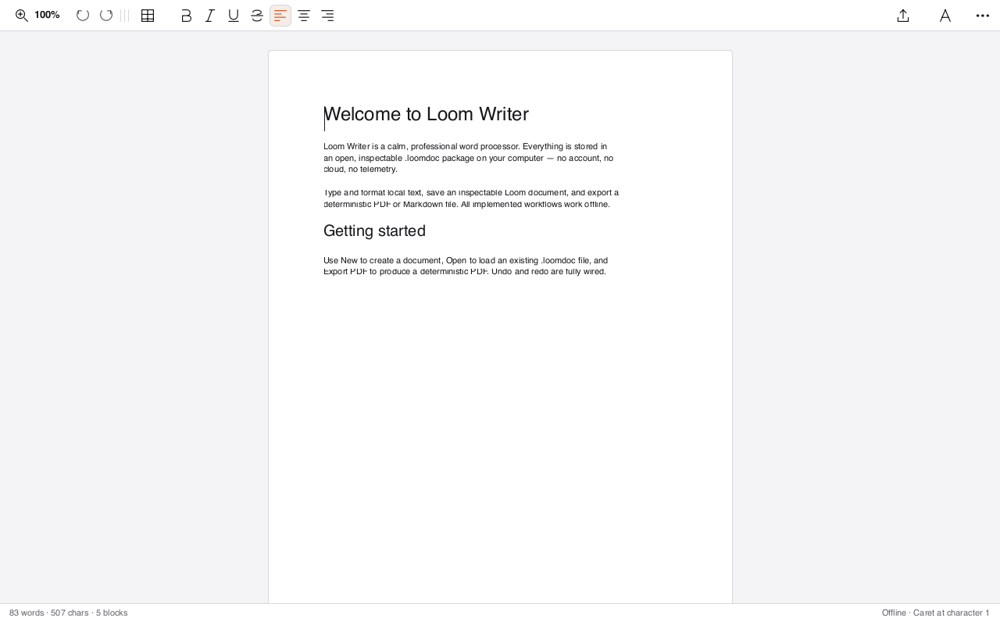 | 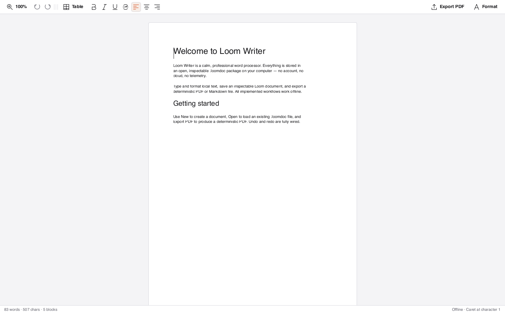 | 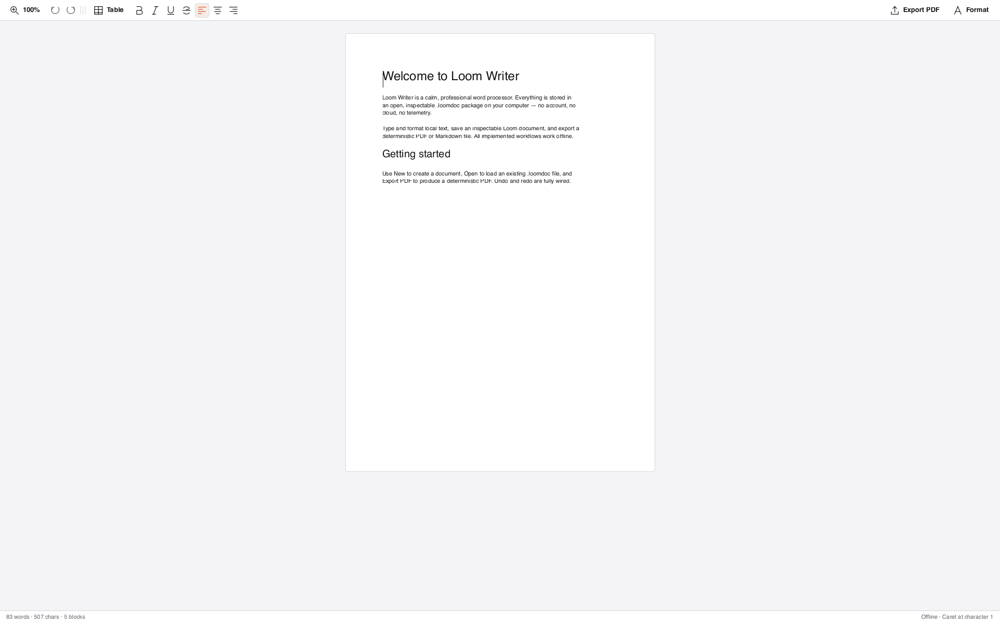 |
| 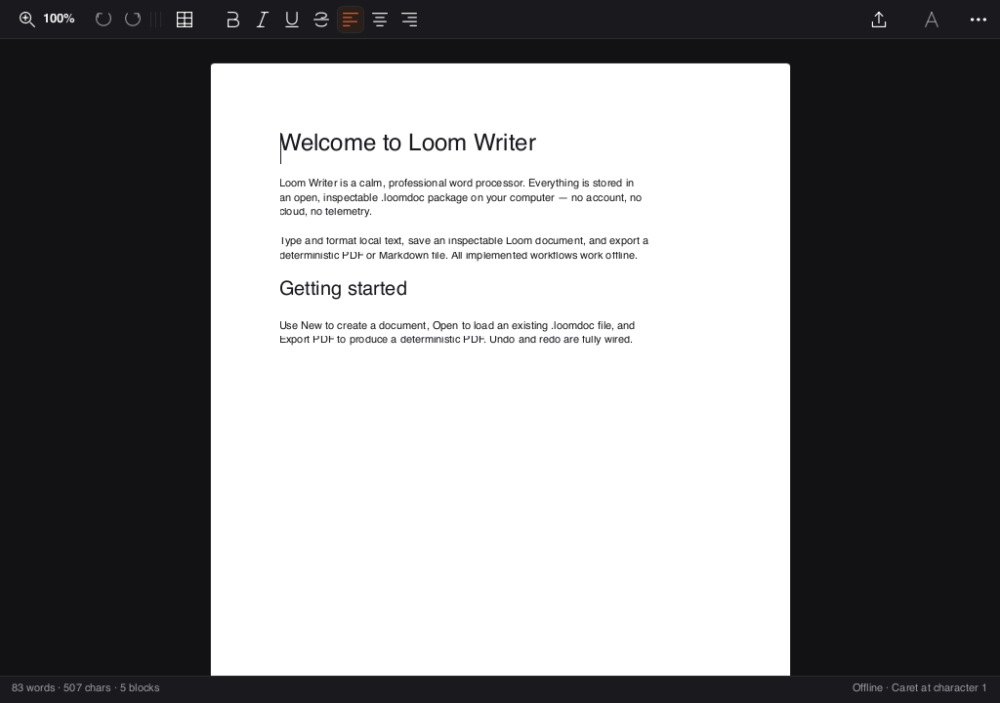 | 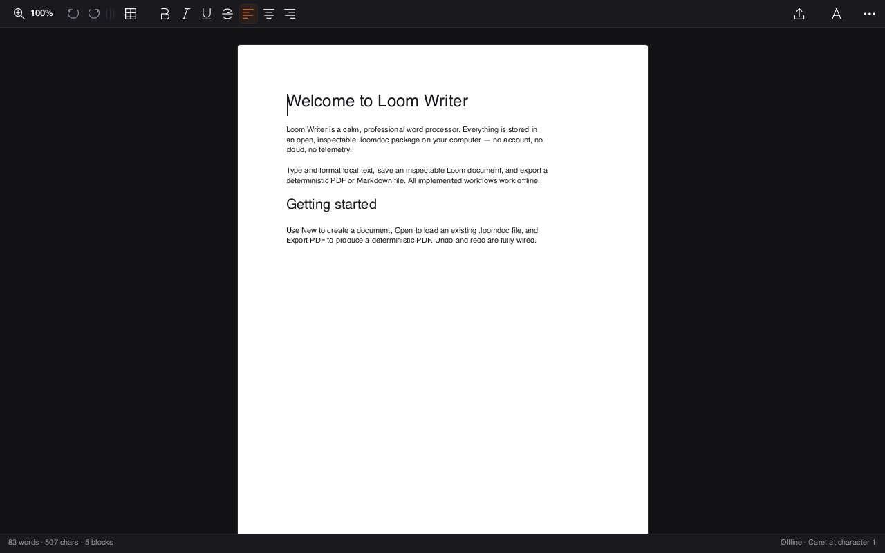 | 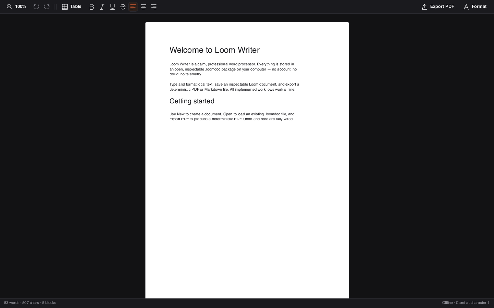 | 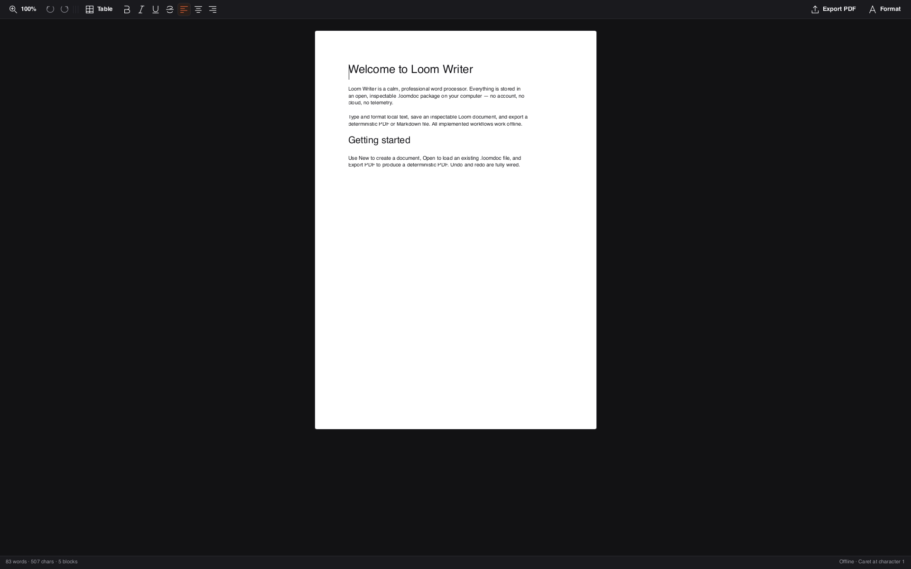 |
| 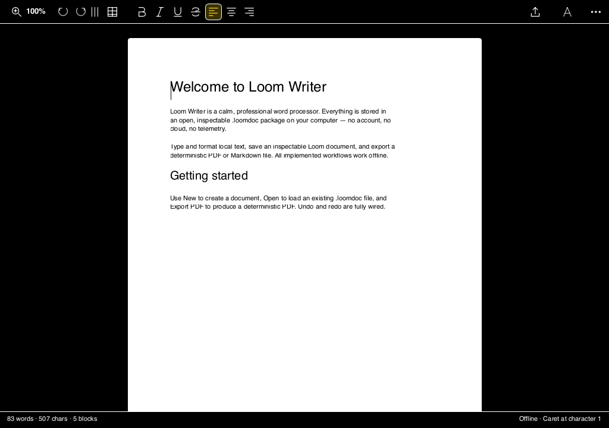 | 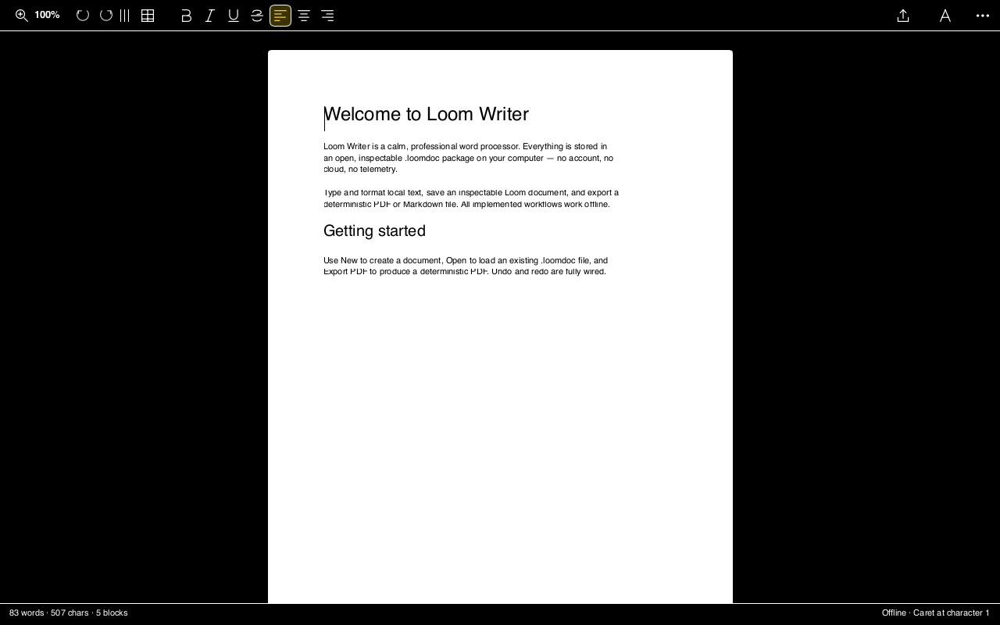 | 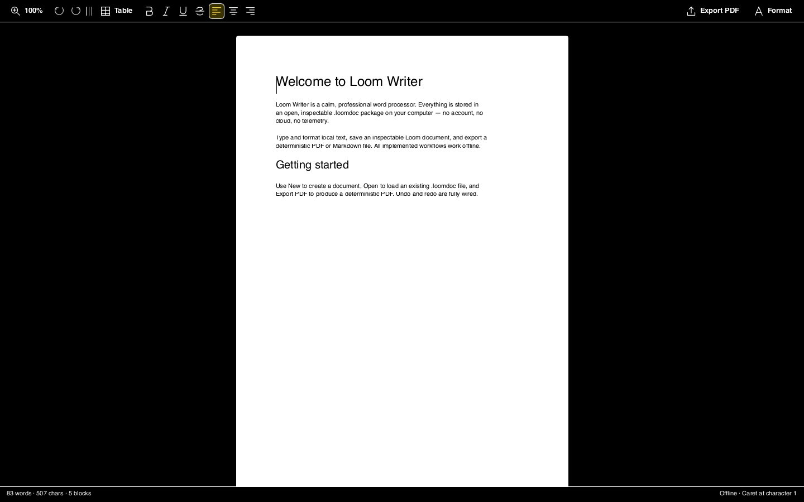 | 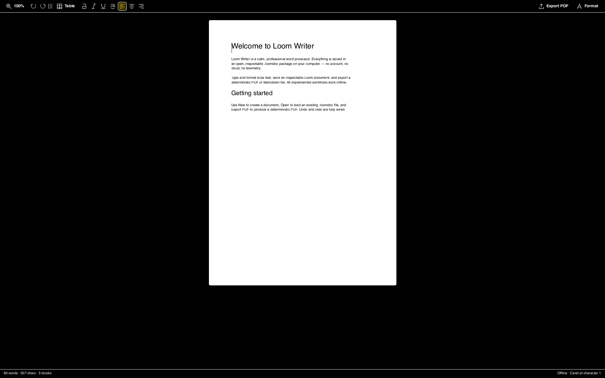 |

Light/dark/high-contrast rows; the full 18-capture set (including inspector and template-chooser states at every viewport) lives in [`docs/acceptance/`](docs/acceptance).

### Inspector with comments and a table (1280×800, light)

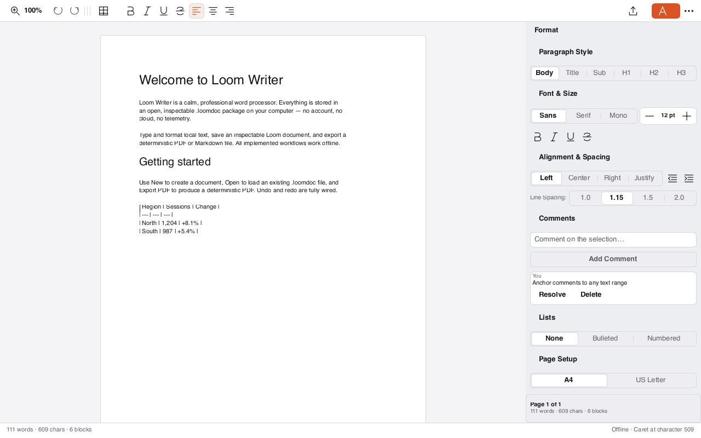

### Native macOS captures (live GUI, `screencapture -l`)

| Light | Dark inspector (seeded comment) |
|---|---|
| 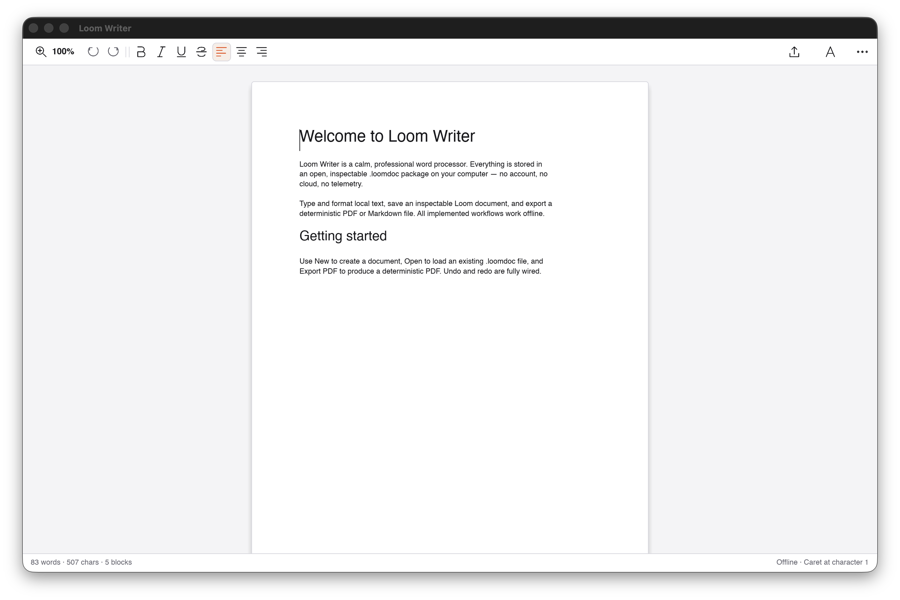 | 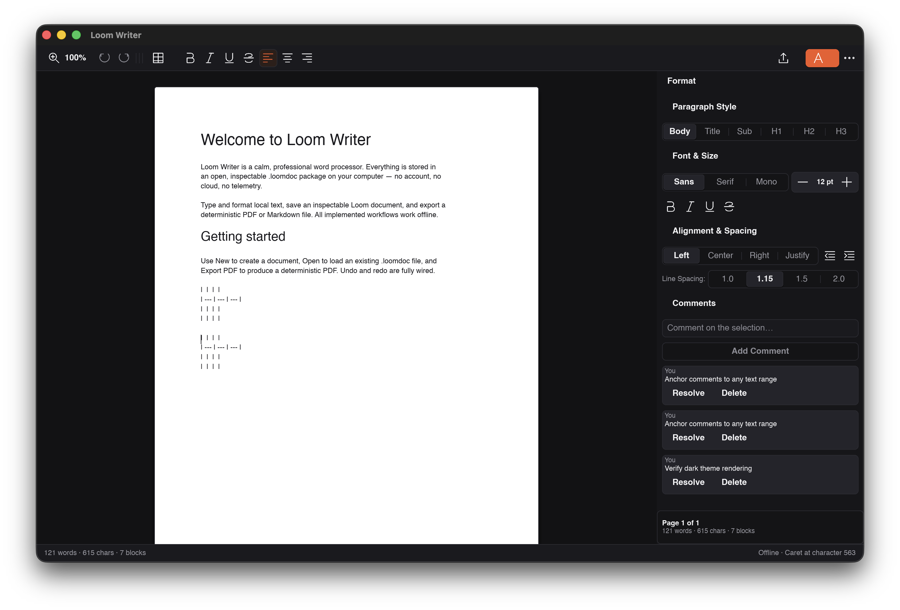 |

All nine native captures (themes, inspector, template chooser, palette, table) live in [`docs/qa-native/`](docs/qa-native).

## Development

```sh
cargo test --manifest-path loom-writer/Cargo.toml
cargo run --manifest-path loom-writer/Cargo.toml -p loom-writer-app
# Headless QA capture:
cargo build --manifest-path loom-writer/Cargo.toml
```
