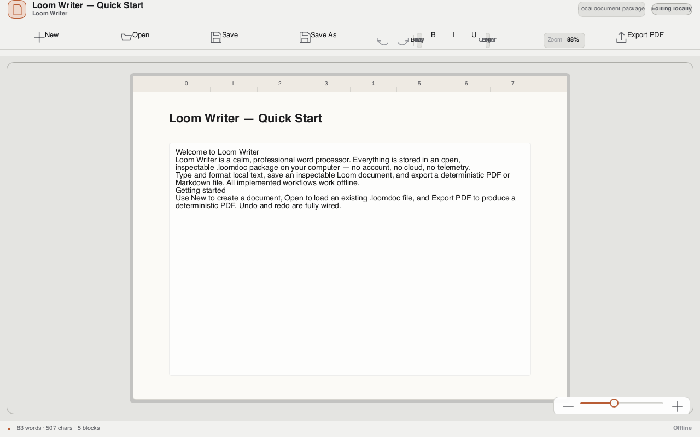

# Loom Writer

Distraction-free local word processor: rich blocks, styles, pagination metrics, PDF export, `.loomdoc` packages.



## Visual QA (macOS, software renderer, 1280×800, 2026-08-25)

- - DEFECT: toolbar labels collide near B/I/U cluster (Bold/Underline overlap neighbors).
- - DEFECT: consecutive paragraphs render with zero visual spacing.
- - Status bar honest: words/chars/blocks, Offline.

## Development

```sh
cargo test --workspace
cargo run -p loom-writer-app
# Headless QA capture (dev-only surface):
cargo build -p loom-writer-app --features visual-qa
```
